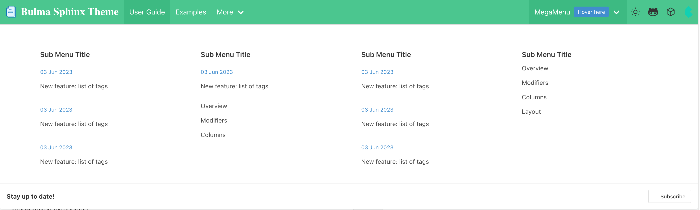

# Navbar configuration

## Changing the navbar color style

The navbar color style can be changed using the following configuration, see [Bulma Navbar Colors](https://bulma.io/documentation/components/navbar/#colors) for more information,

```python
html_theme_options = {
    "navbar_color_style": "is-white"
}
```

## Fix navbar

The navbar will be hidded when scrolling, to make navbar fixed when scrolling, using the following configuration,

```python
html_theme_options = {
    "fix_navbar": True,
}
```

## Disable navbar

You can also disable navbar using the following configuration, the apperance will be like [Furo](https://pradyunsg.me/furo/quickstart/).

```python
html_theme_options = {
    "have_top_navbar": False
}
```

```{note}
When you disable navbar, fix navbar will not work even you set `fix_navbar` to `True`.
```

## Changing header icons

Bulma sphinx theme allows customising the icons that are presented in the header. These icons can be used to link to relevant resources for your project and documentation. To add custom header icons, you need to provide the `icon_links` configuration value as follows,

```python
html_theme_options = {
    "icon_links": [
        {"name":"Gitlab", "url": "http://gitlabcom/zclab/bulma-sphinx-theme", "fontawesome":"fa-brands fa-lg fa-gitlab"},
    ],
}
```

````{note}
If you wish to use Font Awesome icons, Using `html_css_files` to add the CSS file(s) for Font Awesome.
```python
html_css_files = [
    "https://cdnjs.cloudflare.com/ajax/libs/font-awesome/6.0.0/css/fontawesome.min.css",
    "https://cdnjs.cloudflare.com/ajax/libs/font-awesome/6.0.0/css/solid.min.css",
    "https://cdnjs.cloudflare.com/ajax/libs/font-awesome/6.0.0/css/brands.min.css",
]
```
````

## Add Mega Menus to navbar



### usage

Put the following template into `_templates` dir, add set `navbar_start` or `navbar_end` theme option to include this megamenu template.

```html
<div class="navbar-item has-dropdown is-hoverable is-mega">
    <div class="navbar-link flex">
        MegaMenu <span class="tag is-info ml-2">Hover here<span>
    </div>
    <div class="navbar-dropdown">
        <div class="container is-fluid">
            <div class="columns">
                <div class="column">
                    <h1 class="title is-6 is-mega-menu-title">Sub Menu Title</h1>
                    <a class="navbar-item" href="{{ pathto(root_doc) }}">
                        <div class="navbar-content">
                            <p>
                                <small class="has-text-info">03 Jun 2023</small>
                            </p>
                            <p>New feature: list of tags</p>
                        </div>
                    </a>
                    <a class="navbar-item" href="{{ pathto(root_doc) }}">
                        <div class="navbar-content">
                            <p>
                                <small class="has-text-info">03 Jun 2023</small>
                            </p>
                            <p>New feature: list of tags</p>
                        </div>
                    </a>
                    <a class="navbar-item" href="{{ pathto(root_doc) }}">
                        <div class="navbar-content">
                            <p>
                                <small class="has-text-info">03 Jun 2023</small>
                            </p>
                            <p>New feature: list of tags</p>
                        </div>
                    </a>
                </div>
                <div class="column">
                    <h1 class="title is-6 is-mega-menu-title">Sub Menu Title</h1>
                    <a class="navbar-item" href="{{ pathto(root_doc) }}">
                        <div class="navbar-content">

                            <p>
                                <small class="has-text-info">03 Jun 2023</small>
                            </p>
                            <p>New feature: list of tags</p>
                        </div>
                    </a>
                    <a class="navbar-item " href="{{ pathto(root_doc) }}">
                        Overview
                    </a>
                    <a class="navbar-item " href="https://bulma.io/documentation/modifiers/syntax/">
                        Modifiers
                    </a>
                    <a class="navbar-item " href="https://bulma.io/documentation/columns/basics/">
                        Columns
                    </a>
                </div>
                <div class="column">
                    <h1 class="title is-6 is-mega-menu-title">Sub Menu Title</h1>
                    <a class="navbar-item" href="{{ pathto(root_doc) }}">
                        <div class="navbar-content">
                            <p>
                                <small class="has-text-info">03 Jun 2023</small>
                            </p>
                            <p>New feature: list of tags</p>
                        </div>
                    </a>
                    <a class="navbar-item" href="{{ pathto(root_doc) }}">
                        <div class="navbar-content">
                            <p>
                                <small class="has-text-info">03 Jun 2023</small>
                            </p>
                            <p>New feature: list of tags</p>
                        </div>
                    </a>
                    <a class="navbar-item" href="{{ pathto(root_doc) }}">
                        <div class="navbar-content">
                            <p>
                                <small class="has-text-info">03 Jun 2023</small>
                            </p>
                            <p>New feature: list of tags</p>
                        </div>
                    </a>

                </div>
                <div class="column">
                    <h1 class="title is-6 is-mega-menu-title">Sub Menu Title</h1>
                    <a class="navbar-item " href="{{ pathto(root_doc) }}">
                        Overview
                    </a>
                    <a class="navbar-item " href="https://bulma.io/documentation/modifiers/syntax/">
                        Modifiers
                    </a>
                    <a class="navbar-item " href="https://bulma.io/documentation/columns/basics/">
                        Columns
                    </a>
                    <a class="navbar-item " href="https://bulma.io/documentation/layout/container/">
                        Layout
                    </a>
                </div>
            </div>
        </div>

        <hr class="navbar-divider">
        <div class="navbar-item">
            <div class="navbar-content">
                <div class="level is-mobile">
                    <div class="level-left">
                        <div class="level-item">
                            <strong>Stay up to date!</strong>
                        </div>
                    </div>
                    <div class="level-right">
                        <div class="level-item">
                            <a class="button bd-is-rss is-small" href="https://bulma.io/atom.xml">
                                <span class="icon is-small">
                                    <i class="fa fa-rss"></i>
                                </span>
                                <span>Subscribe</span>
                            </a>
                        </div>
                    </div>
                </div>
            </div>
        </div>
    </div>
</div>

```
